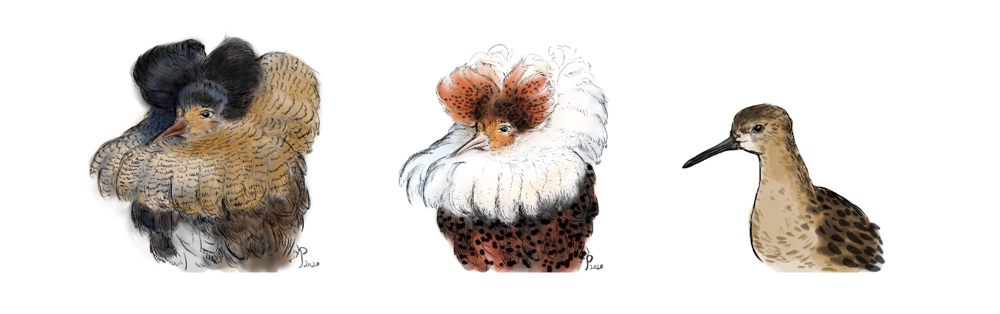

## Supporting information for "Sperm swimming speed and morphology differ slightly among the three genetic morphs of ruff sandpiper (*Calidris pugnax*)"

### **Overview**

Contains data collection and preregistration protocols, recordings and pictures of sperm to measure sperm motility and morphology in the three ruff morphs, meta-data on individual males, raw data and computer code to generate outputs of the analysis for the paper ([preprint](https://www.biorxiv.org/content/10.1101/2023.07.27.550846v1)). 

When using this content **PLEASE CITE** the [paper](https://www.biorxiv.org/content/10.1101/2023.07.27.550846v1) and [this repository](https://github.com/MartinBulla/ruff_sperm_v2).

### **Files & Folders**
[Supplement](https://nbviewer.org/github/MartinBulla/ruff_sperm_v2/blob/main/Supplement.pdf): pdf with supplementary methods, figures and tables

[Data](Data/): raw data and manipulated data (starting with 'DAT_') generated with R-scripts
- [sperm_recs](Data/sperm_recs/): Recordings of sperm motility
- [sperm_pics](Data/sperm_pics/): Pictures of individual sperm cells ([original](/Data/sperm_pics/original/)), their  inverted version ([inverted](/Data/sperm_pics/inverted/)) of which 920 were chosen for measurements in SpermSizer ([measured](/Data/sperm_pics/measured/)) and before actual measurements randomized ([random_inv](/Data/sperm_pics/random_inv/))
- [sperm_morpho](Data/sperm_morpho/): Folders (named as date and sperm batch) containing: 
    - *measure* folder with inverted randomised pictures measured in a given batch; if further manipulation of the picture was needed, an alternative picture is included; note that tails were measured on desaturated pictures and included are additional folders with inverted (*random_inv*) and desaturated images (*random_des*) as that improves workflow with Sperm Sizer software (see [sperm measuring protocol](https://raw.githack.com/MartinBulla/ruff_sperm_v2/main/Protocols/Protocol_sperm_measuring-with_SpermSizer_mod-with-GIMP_inv_des.pdf))
    - *Results* folder created by Sperm Sizer software, having date and time of the measurement in the name, and containing pictures of each measured part with indicated measurement lines and line lengths (in pixels), and respective Excel files with measurements, all corresponding to the picture names in *measure*
- [sperm_40_test](Data/sperm_morpho/): contains a sample of 40 sperm pictures ([inverted](Data/sperm_40_test/random_inv) and [desaturated](Data/sperm_40_test/random_inv)) used for repeated measurements with Sperm Sizer included in folders MB_inv, MC_1, and MC_2; the measurements were used to estimate within and between observer repeatability; folder with mod in the name show pictures that needed further modifications for Sperm Sizer to work 
- [mcmc](https://osf.io/pbfzk/): contains Rdata files with mcmc chains and model outputs from the brms models; because of file size issues the folder is located at the [OSF repository](https://osf.io/pbfzk/)

[R](R/)-scripts used in the analysis; those starting with 
- "DAT" prepare data for analysis
- "Fig or Table" create figures or tables
- "MET_sample-sizes.R" provides sample sizes for the Methods and Results section
- "EXP_relatedness_effects.R" explores mixing of the mcmcm chains in the brms analyses
- "tools.R" tools necessary for most of the R-scripts and sourced within those
- "Out_velocity-videos.Rmd" script to create html docuement showing the ruff and zebra finch motility
- "Preregistration_v3.Rmd" script to create html document of a priory methods of data collection and analyses
- "protocol_sperm.Rmd" script to create html document of sperm sampling, sample preparation, and picture-taking protocol
- "_runRmarkdown.R" generates htmls from Rmd scripts

[Outputs](Outputs/): all outputs used in the manuscript and Supplement

[Protocols](Protocols/): Protocols used in this study, including Rmd source code and example videos for respective html documents
- [*A priory* study design](https://raw.githack.com/MartinBulla/ruff_sperm_v2/main/Protocols/Preregistration_v3.html)
- [Sperm sampling and sample preparation](https://raw.githack.com/MartinBulla/ruff_sperm_v2/main/Protocols/protocol_sperm.html)
- [Sperm measuring with Sperm Sizer](https://nbviewer.org/github/MartinBulla/ruff_sperm_v2/blob/main/Protocols/Protocol_sperm_measuring-with_SpermSizer.pdf)
- [Layout of the aviaries](Protocols/Aviaries)

[Illustrations](Illustrations): ruff morph and zebra finch pictures used in the graphs, drawn by Yifan Pei, an example video of abdominal massage used in the [sperm sampling protocol](https://raw.githack.com/MartinBulla/ruff_sperm_v2/main/Protocols/protocol_sperm.html) and two example videos of ruff and zebra finch sperm motility (cut from the original videos from [sperm_recs](Data/sperm_recs/)) and linked to from within the paper

[Sperm Sizer](sperm-sizer-1.6.6): Sperm Sizer 1.6.6 (.jar for Mac, .exe for PC; downloaded from [GitHub](https://github.com/wyrli/sperm-sizer)) with config.ini configured for this study

[LICENSE](LICENSE): terms of reuse
